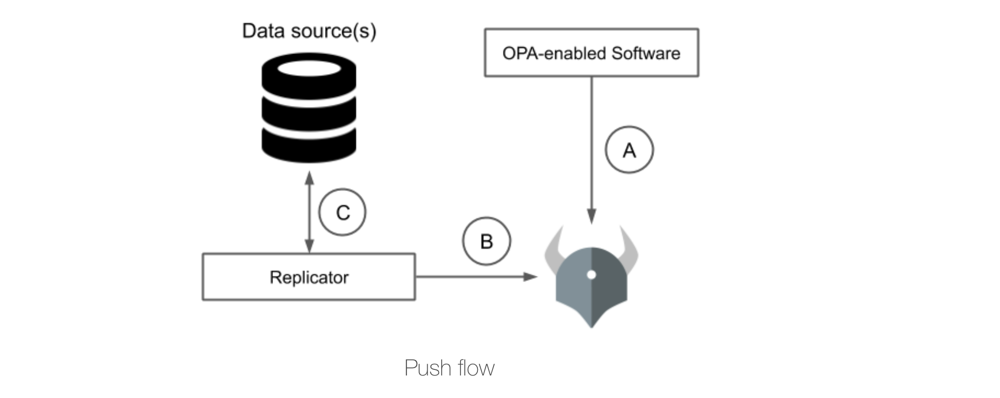

# OPA Push Data Flow

## opa-pushdata-replicator
Dynamic replicator that pulls information out of the external data source and pushes that information into OPA through its API using bundle server

optimize for update latency and network traffic.
## Documentation

[Documentation](https://linktodocumentation)

## Environment Variables

To run this project, you will need to add the following environment variables to your .env file

`API_KEY`

`ANOTHER_API_KEY`

## FAQ

#### Question 1

Answer 1

#### Question 2

Answer 2

